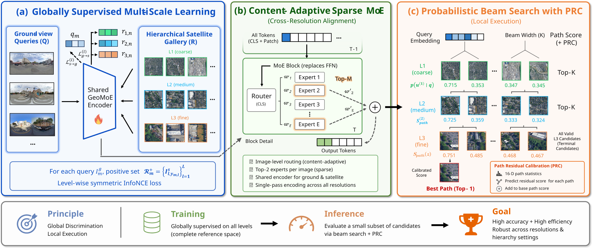
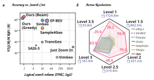

# GeoMoE

**Multi-scale mixture-of-experts for efficient hierarchical cross-view geo-localization**

[](https://www.python.org/)
[](https://pytorch.org/)
[](https://arxiv.org/pdf/2608.01060)
[](https://huggingface.co/Frank0666/GeoMoE)
[](https://huggingface.co/datasets/Frank0666/VIGOR-M)
[](LICENSE)

GeoMoE unifies multiple geographic scales in one DINOv2 dual encoder. Its final
Transformer FFN is replaced by a sparse Top-2 mixture of five experts, while a
coarse-to-fine beam search avoids exhaustive scoring at fine resolution. A small
path residual calibrator (PRC), trained only on the official training split,
reranks the final beam without test-time label adaptation.


<!-- > **Figure slot:** paper teaser and qualitative overview (`assets/teaser.png`). -->

## Highlights

- One shared B11/E5 backbone handles three VIGOR-M scales or four JustZoomIn scales.
- Level-wise InfoNCE prevents samples from different physical scales becoming false negatives.
- Dense coarse references improve boundary coverage; only a small K=4 beam reaches fine tiles.
- PRC learns a residual over path probability, similarity, rank, margin, and entropy features.
- Complete training and evaluation code is provided for VIGOR-M and JustZoomIn.


<!-- > **Figure slot:** model architecture, routed FFN, and training objectives (`assets/framework.png`). -->

## Main Results

All numbers below use the released B11/E5 Top-2 checkpoint and fixed K=4 beam.
PRC is fitted on the official training split only.

### VIGOR-M

| Queries | R@1 | R@100m | R@200m | R@300m | Median | Avg. final candidates |
|--:|--:|--:|--:|--:|--:|--:|
| 37,789 | **62.3912%** | **77.8163%** | **84.3023%** | **86.8639%** | 52.3255 m | 47.00 |

### JustZoomIn

| Queries | R@1 | R@40m | R@50m | R@100m | Median | Avg. final candidates |
|--:|--:|--:|--:|--:|--:|--:|
| 30,956 | **81.7063%** | **95.7811%** | **96.3238%** | **97.6838%** | 16.4321 m | 25.12 |

The exhaustive JustZoomIn L4 diagnostic reaches 82.0939% R@1, but scores all
12,029 fine references. It is not the Beam + PRC result above.

## Efficiency

GeoMoE combines high retrieval accuracy with a compact search budget through
coarse-to-fine beam search. The figure compares accuracy against logical search
volume and summarizes performance across VIGOR-M resolutions.



## Method Overview

GeoMoE uses one shared dual encoder for ground and satellite images at every
geographic scale. DINOv2 blocks B0-B10 remain fully shared, while the FFN in
B11 is replaced by five experts with sparse Top-2 routing. During training,
level-wise InfoNCE forms negatives only among samples from the same scale.

| Dataset | Retrieval hierarchy | Dense galleries |
|:--|:--|:--|
| VIGOR-M | L1 -> L2 -> L3 | L1, stride 0.25 |
| JustZoomIn | L1 -> L2 -> L3 -> L4 | L1 and L2, stride 0.25 |

At inference, the query is encoded once and matched against the coarsest dense
gallery using cosine similarity. The top K=4 nodes are expanded to their
children, whose temperature-scaled log-probabilities are added to the parent
path scores. This expand-score-prune step continues to the finest level. A
train-only path residual calibrator (PRC) then reranks the final candidates from
their path scores, cosine similarities, ranks, margins, and entropies.

Block indices are zero-based, so **B11 routes only the final Transformer FFN**.

<!-- Add the final paper figure here when available:

-->

## Installation

```bash
git clone https://github.com/fanrj3/GeoMoE.git GeoMoE
cd GeoMoE

python -m venv .venv
source .venv/bin/activate
pip install --upgrade pip
pip install -e .
```

The DINOv2 backbone is resolved by `timm` on first use. Set `HF_HOME` and
`TORCH_HOME` yourself when the default cache location is unsuitable.

## Weights

Model binaries live in a separate Hugging Face Git/LFS repository and are
intentionally absent from GitHub. Clone that repository as the ignored nested
`weights/` checkout:

```bash
git clone https://huggingface.co/Frank0666/GeoMoE weights
python scripts/tools/verify_weights.py --weights weights
```

The release contains one backbone and one train-only PRC for each dataset. See
[docs/WEIGHTS.md](docs/WEIGHTS.md) for layout, checksums, and LFS instructions.

## Data

Place or symlink datasets under `data/`:

```text
data/
├── VIGOR-M/
│   ├── panoramas/<city>/*.jpg
│   ├── satellite/<city>/L0..L3/*.png
│   └── metadata/{city_bounds.csv,*.csv}
└── justzoomin/
    ├── metadata/{large_area_train_map.csv,large_area_val_map.csv}
    ├── streetview/images/*.jpg
    └── satellite/{layout.yaml,0,-1,...,-9}
```

The canonical VIGOR-M bundle is directly usable after download. Dataset
maintainers can build it from the raw assets and the frozen experiment CSVs:

```bash
python scripts/data/prepare_vigor_m_release.py \
  --source-root /datasets/VIGOR-M-raw \
  --metadata-source /datasets/VIGOR-M-frozen-metadata \
  --output data/VIGOR-M --mode symlink
```

The official JustZoomIn download already contains every required metadata file;
extract it unchanged into `data/justzoomin`. Dense L1/L2 crops are an optional
derived cache for faster repeated runs:

```bash
python scripts/data/prepare_justzoomin_cache.py \
  --data-folder data/justzoomin --levels L1 L2 \
  --splits train val --satellite-stride-fraction 0.25
```

Dataset-specific details and attribution are in [docs/DATASETS.md](docs/DATASETS.md).

## Training

The trainers launch one process per comma-separated GPU ID. The checked-in
defaults reproduce B11/E5 with DINOv2 initialization, 60 epochs, batch size 128
per GPU, and learning rate `1e-4`.

```bash
# VIGOR-M
python scripts/train/train_vigor_m.py \
  --data-folder data/VIGOR-M \
  --gpu-ids 0 --run-name vigor_m_b11_e5

# JustZoomIn
python scripts/train/train_justzoomin.py \
  --data-folder data/justzoomin \
  --gpu-ids 0 --run-name justzoomin_b11_e5
```

Multi-GPU training uses the same entry points, for example `--gpu-ids 0,1,2,3`.
See [docs/TRAINING.md](docs/TRAINING.md) for initialization, resume behavior,
sampling, and output structure.

## Evaluation

JustZoomIn is evaluated end to end with one command:

```bash
python scripts/eval/evaluate_justzoomin.py \
  --checkpoint weights/justzoomin/geomoe_b11_e5_e60.pth \
  --calibrator-checkpoint weights/justzoomin/path_calibrator.pt \
  --data-folder data/justzoomin
```

VIGOR-M evaluation first extracts auditable feature bundles, then builds the
calibrated action table and reports fixed K=4. The complete commands, including
refitting PRC strictly on official train, are in
[docs/EVALUATION.md](docs/EVALUATION.md).

## Repository Layout

```text
GeoMoE/
├── geomoe/                    # models, losses, transforms, dataset adapters
├── scripts/
│   ├── train/                 # full single-/multi-GPU trainers
│   ├── eval/                  # feature extraction, beam search, PRC evaluation
│   ├── data/                  # portable dataset staging and optional caches
│   └── tools/                 # release integrity checks
├── configs/                   # exact B11/E5 method specifications
├── docs/                      # data, training, evaluation, and weight guides
├── assets/                    # reserved paper figure slots
├── data/                      # ignored local datasets
├── outputs/                   # ignored runs, caches, and metrics
└── weights/                   # ignored, independent Hugging Face Git repository
```

## Reproducibility Notes

- Checkpoint and PRC SHA256 hashes are recorded in `weights/manifest.json`.
- Beam width is locked to K=4 and softmax temperature to 0.07 for main results.
- PRC never consumes test labels. VIGOR-M uses official train -> full test;
  JustZoomIn uses official train -> val.
- Ground inputs are resized to 432 x 768 and satellite inputs to 384 x 384.
- Feature bundles store query/gallery order hashes and reject protocol drift.

## Acknowledgements

GeoMoE builds on DINOv2, `timm`, and the Sample4Geo dual-encoder training recipe.
We thank the VIGOR-M and JustZoomIn authors and the maintainers of their source
imagery. See [NOTICE.md](NOTICE.md) for redistribution and data attribution notes.

## License

Code is released under the [Apache License 2.0](LICENSE). Dataset licenses and
third-party notices remain separate.
